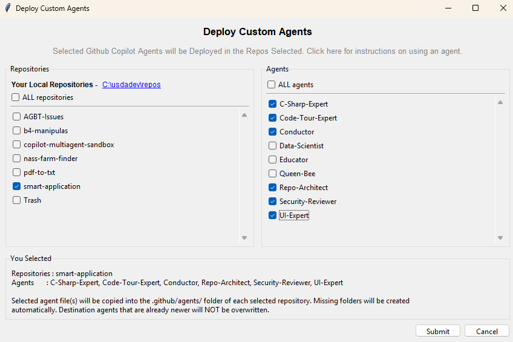

# gh-copilot-master-agents

This repository serves as the master list of NASS agent personas for use in VS Code with GitHub Copilot. It centralizes custom instructions, roles, and guidelines for different AI personas (e.g., C# Expert, Data Scientist, Security Reviewer). 

## What This Repo Does
- Stores and maintains `.agent.md` files in the `personas/` directory under in this repo.
- Acts as a master template collection for specialized AI assistants within the organization.

## What is a custom agent?
- A custom agent is a reusable GitHub Copilot persona defined in a Markdown file with the `.agent.md` extension. The file combines frontmatter settings such as the agent name, description, and allowed tools with a body of instructions that tells Copilot how that agent should behave.
- For repository-scoped agents, the default workspace location is `.github/agents/`. You can also create user-level agents in your Copilot profile so they are available across workspaces, but `.github/agents/` is the standard location for sharing an agent with everyone working in a repository.
- When an agent file is named correctly, placed in the correct location, and discovered by VS Code, it appears in the Copilot Chat agent picker. Selecting that agent makes it available in the Copilot chat interface.
- When the agent is active, Copilot reads the agent persona text in the `.agent.md` file before servicing the chat request. In practice, that persona acts like a reusable system prompt that shapes tone, scope, tool use, and task behavior for the conversation.

## To Use
This repository includes a Python deployment script (`deploy_agents.py`) featuring a Tkinter GUI to easily manage and distribute these agents. 

Run the script using Python:
\`\`\`bash
python deploy_agents.py
\`\`\`

### Features of the Script:
1. **Target Selection**: Select which sibling repositories on your local machine should receive the agent files.
2. **Agent Selection**: Choose specific `.agent.md` files to copy from the `personas/` folder.
3. **Preview**: Review your selected deployment configuration before submitting.
4. **Automated Directory Creation**: Automatically creates the required `.github/agents/` directory structure under the target repositories.
5. **Smart Copying**: Copies the agent files to the selected targets, automatically skipping files in the destination that are already newer.
6. **Logging**: All operations are timestamped and recorded in the local `logs/` directory.

### GUI Walkthrough

Select your target repositories and agents, then click **Submit** to deploy:

A confirmation dialog summarizes your selections before deployment proceeds:

After deployment, a results dialog shows which files were copied or skipped:

### Using a Deployed Agent in VS Code

Once an agent has been deployed to a repository (copied into its `.github/agents/` folder), open that repository in VS Code. In the GitHub Copilot Chat window, click the **Set Agent** menu to see and select agents available for that repository:

## Agent Template: `agent-template.agent.md`

This file is the starting point for creating your own custom agent persona. Follow these steps:

1. Save this template file as a new `.agent.md` file with a clear persona name (for example, `analytics-coach.agent.md`).
2. Open your new file and set the metadata values (name, description, and any frontmatter fields used by the template).
3. Update the `author` field to your GitHub username.
4. Write the persona content by defining the mission, behavior, scope, and boundaries.
5. Edit the `tools:` section and keep only the tools this persona actually needs.
6. Review the file for clarity and remove any leftover placeholder text from the template.
7. Save your customized agent file in `personas/` and deploy it using `deploy_agents.py` when ready.

### Available Tools
Below are the tool IDs you can enable for your agent. Keep only the tools your persona truly needs. 

> **Note:** The available tools and their identifiers change frequently as Copilot evolves. It's best to work through them lightly and test them to get what you need.

> **Important:** Use normalized tool IDs (for example, `search`, not `search/codebase`).

- **search**
- **read**
- **execute**
- **edit**
- **todo**
- **web**
- **vscode**
- **agent**

#### Python-Specific Tools
These tools are available when Python support is enabled in your VS Code environment.

- **ms-python.python/configurePythonEnvironment**: Set/select a Python environment for a workspace or file.
- **ms-python.python/getPythonEnvironmentInfo**: Retrieve Python environment details (type, version, installed packages).
- **ms-python.python/getPythonExecutableCommand**: Get the exact executable/command for running Python in the selected environment.
- **ms-python.python/installPythonPackage**: Install Python packages into the selected environment.

> **Tip:** Review the template and create your own agent that others can use!

## Orchestrator Template: `agent-orchestrator-template.md`

This repository includes an orchestrator persona template (`agent-orchestrator-template.md`) you can use to coordinate focused agents (subagents) into a simple multi-step workflow.

How to use the orchestrator
1. Customize the orchestrator: copy `agent-orchestrator-template.md` into `personas/`, rename it with a clear persona name, and update the frontmatter and instructions.
2. Prepare subagents: create focused `.agent.md` files for each role; keep responsibilities narrow and well-defined.
3. Deploy the orchestration set: use `deploy_agents.py` (or copy files) to deploy the orchestrator and subagents to the target repository's `.github/agents/` directory.
4. Run in VS Code: open the target repo, select the orchestrator agent in Copilot Chat, and ask it to run your workflow. The orchestrator typically delegates work to subagents via the `runSubagent` tool, aggregates outputs, and returns the final result.

Tips
- Keep subagents small and test them individually before composing them under an orchestrator.
- Define clear input/output contracts so the orchestrator can reliably combine subagent outputs.
- See `docs/subagents-info.md` for examples and recommended patterns.

## Worth Exploring
Organization-level custom agents are supported. Organization owners can create a repository named `.github-private` and store agent files in the root `agents/` directory, for example `agents/CUSTOM-AGENT-NAME.agent.md`. In VS Code, users can discover these agents across the organization when `github.copilot.chat.organizationCustomAgents.enabled` is enabled and they have access to the organization agent repository. [Click here for more information.](https://docs.github.com/en/copilot/how-tos/administer-copilot/manage-for-organization/prepare-for-custom-agents)
